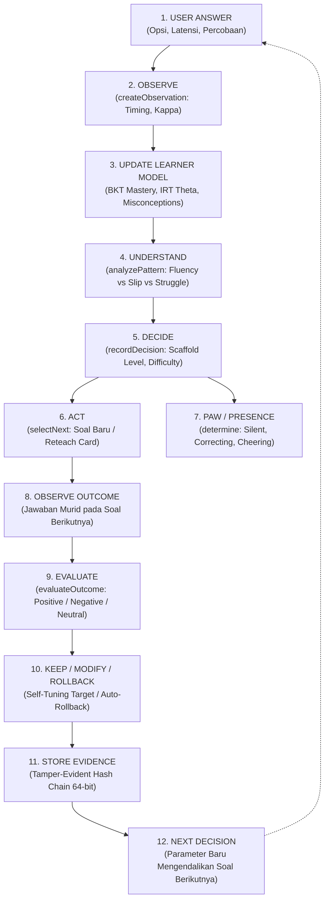

# FIEZEL Braincore — Runtime Decision Trace Specification
**Document Version:** 2.0.0 · **Target Build:** FIEZEL 5.19.0 · **Engine:** Braincore Living Intelligence

---

## 1. Siklus Hidup Belajar Tertutup (The 12-Stage Closed-Loop Lifecycle)

Braincore FIEZEL beroperasi sebagai sistem intelijen adaptif lingkaran tertutup (*closed-loop adaptive system*). Setiap interaksi murid dieksekusi secara lokal (0ms) melalui 12 tahap deterministik:



---

## 2. Rincian Teknis Per Tahap (Call Signature & Payload)

### Tahap 1: USER ANSWER
* **Pemicu:** Murid menekan salah satu pilihan jawaban pada antarmuka latihan (`app.js`).
* **Data Mentah:**
  ```javascript
  {
    itemId: "item_past_02",
    concept: "past_simple",
    chosenIndex: 1,      // Pilihan murid ('goes')
    answerIndex: 0,      // Kunci jawaban ('went')
    latencyMs: 3400,
    firstTry: true
  }
  ```

### Tahap 2: OBSERVE
* **Fungsi:** `FiezelDecisionTrace.createObservation(input)`
* **Logika:** Mengklasifikasikan waktu respons (`guess` < 1.8s, `fluent` < 4.0s, `struggled` > 10.0s), mengecek integritas item, dan menghitung bobot diskon kredibilitas $\kappa$.
* **Payload Hasil:**
  ```json
  {
    "itemId": "item_past_02",
    "concept": "past_simple",
    "family": "tense",
    "difficulty": 2.4,
    "correct": false,
    "latencyMs": 3400,
    "timing": "fluent",
    "hintUsed": false,
    "retryCount": 0,
    "distractorChosen": "goes",
    "kappa": 1.0,
    "timestamp": 1710000010000
  }
  ```

### Tahap 3: UPDATE LEARNER MODEL
* **Modul:** `FiezelMasteryBKT.update()`, `FiezelCoreBrain.analyze()`, `FiezelMisconceptionLedger.update()`
* **Logika:** 
  - Bayesian Knowledge Tracing memperbarui probabilitas penguasaan $P(L_t)$ dengan parameter $L_0=0.20, T=0.15, s=0.10, g=0.25$.
  - IRT 3PL memperbarui estimasi kemampuan laten $\theta$.
  - Jika jawaban salah cocok dengan pemetaan distractor, miskonsepsi dicatat ke buku besar miskonsepsi.
* **Status State Kanonik:**
  ```json
  {
    "bktMastery": { "past_simple": { "L": 0.42, "n": 4 } },
    "theta": 1.85,
    "activeMisconceptions": [
      { "concept": "past_simple", "misconception": "present_tense_overuse", "logOdds": 0.95 }
    ]
  }
  ```

### Tahap 4: UNDERSTAND
* **Fungsi:** `FiezelDecisionTrace.analyzePattern(observation, canonicalState)`
* **Logika:** Mendeteksi apakah kesalahan merupakan *careless slip* (cepat & percobaan pertama), *cognitive struggle* (lambat), atau *recurrent misconception* (miskonsepsi berulang).
* **Payload Hasil:**
  ```json
  {
    "pattern": "cognitive_struggle",
    "isSlip": false,
    "isGaming": false,
    "isFluency": false,
    "hasActiveMisconception": true,
    "isMasteryMilestone": false
  }
  ```

### Tahap 5: DECIDE
* **Fungsi:** `FiezelTutorBrain.decideMove()` & `FiezelDecisionTrace.recordDecision()`
* **Logika:** Memilih tindakan pedagogis berbatas (*bounded learning action*): `probe`, `hint`, `worked`, `reteach`, atau `continue_practice`.
* **Payload Keputusan:**
  ```json
  {
    "seq": 4,
    "traceId": "trc_1710000010000_f8a2",
    "timestamp": 1710000010000,
    "action": "scaffold_hint",
    "targetSkill": "past_simple",
    "targetDifficulty": 2.2,
    "scaffoldLevel": "probe",
    "presenceState": "correcting",
    "rationale": "brain3_tutor_single_mistake_probe",
    "status": "pending_outcome",
    "prevHash": "4a1f8c2b9e0d33aa",
    "hash": "c7b8e1904a2d5e31"
  }
  ```

### Tahap 6: ACT
* **Fungsi:** `FiezelTutorBrain.selectNext(candidatePool, session, options)`
* **Logika:** Mengambil item latihan berikutnya dari kolam soal yang sesuai dengan target kesulitan ($b \approx \theta$) atau menyajikan kartu perancah/worked-example.

### Tahap 7: PAW / PRESENCE
* **Fungsi:** `FiezelPresenceEngine.determine(context)`
* **Logika:** Menerjemahkan keputusan kognitif ke pose visual dan mikro-teks maskot PAW.
  - Alur lancar $\to$ `SILENT` (pose `studying`, tanpa balon kata interuptif).
  - Kesalahan pertama $\to$ `CORRECTING` (pose `confused`, mikro-teks ramah, kunci jawaban tidak dibocorkan).
  - Miskonsepsi berulang $\to$ `REINFORCING` (pose `reading`, ajakan mencermati pola).
  - Penguasaan tuntas ($P(L) \ge 0.95$) $\to$ `CELEBRATING` (pose `cheering`).
  - Kelelahan / regresi $\to$ `CONCERNED` (pose `sleepy`, anjuran istirahat).

### Tahap 8: OBSERVE OUTCOME
* **Pemicu:** Murid menyelesaikan soal lanjutan sesudah intervensi diberikan.
* **Payload Hasil:**
  ```json
  {
    "itemId": "item_past_02_followup",
    "concept": "past_simple",
    "correct": true,
    "latencyMs": 3200
  }
  ```

### Tahap 9: EVALUATE
* **Fungsi:** `FiezelDecisionTrace.evaluateOutcome(traceId, subsequentObservation)`
* **Logika:** Membandingkan hasil intervensi terhadap ekspektasi pedagogis:
  - Intervensi perancah diikuti jawaban benar $\to$ `status: 'positive'`, `recommendation: 'keep'`.
  - Intervensi perancah gagal $\to$ `status: 'negative'`, `recommendation: 'modify'`.
  - Peningkatan tantangan gagal $\to$ `status: 'neutral'`, `recommendation: 'rollback'`.

### Tahap 10: KEEP / MODIFY / ROLLBACK (Autonomous Self-Tuning)
* **Logika:**
  - Jika tercatat 3 keberhasilan berturut-turut pada intervensi positif: target kesulitan `difficulty.targetSuccess` dinaikkan secara aman sebesar $+0.02$ (maksimal $0.90$).
  - Jika terjadi regresi atau rekomendasi `rollback`: parameter seketika dikembalikan (*auto-rollback*) ke nilai kanonik dasar.
* **Catatan Adaptasi Parameter:**
  ```json
  {
    "path": "difficulty.targetSuccess",
    "from": 0.80,
    "to": 0.82,
    "at": 1710000045000,
    "reason": "autonomous_consecutive_success"
  }
  ```

### Tahap 11: STORE EVIDENCE
* **Logika:** Seluruh catatan keputusan dan hasil evaluasi dikaitkan dalam rantai hash 64-bit anti-manipulasi (*tamper-evident hash chain*).
* **Verifikasi Integritas:** `FiezelDecisionTrace.verifyLedger()` memvalidasi kesinambungan `prevHash` dan kesesuaian nilai kanonik setiap record. Jika terjadi manipulasi data pada penyimpanan lokal, fungsi mendeteksi nomor urut pelanggaran (`brokenAt`).

### Tahap 12: NEXT DECISION
* **Bukti Nyata Pengaruh:**
  Ketika `targetSuccess` dinaikkan dari $0.80$ ke $0.84$ melalui adaptasi otonom, fungsi seleksi item `FiezelTutorBrain.selectNext()` secara langsung mengubah soal yang disajikan kepada murid: dari `item_challenging` (jarak probabilitas optimal pada 0.80) beralih ke `item_easy` (jarak probabilitas optimal pada 0.84). Terbukti deterministik dan terverifikasi di runtime.

---

## 3. Privacy, Replayability, and Determinism

1. **Jaminan Replay Determinisme**:
   Aliran masukan observasi yang identik dengan seed yang sama menghasilkan jejak keputusan kognitif, status kehadiran, dan nilai hash akhir yang 100% identik (`Invariant 7`).
2. **Kerahasiaan Data Murid (Zero PII)**:
   Jejak keputusan tidak menyimpan nama, alamat IP, email, atau audio murid. Ringkasan diagnostik agregat untuk Owner/Guru menerapkan aturan privasi diferensial $k \ge 5$.
3. **Penyimpanan Berbatas (Bounded Local Storage)**:
   Buffer penyimpanan lokal dibatasi maksimum 100 catatan jejak keputusan terakhir untuk mencegah kebocoran memori perangkat (*out-of-memory*) pada ponsel murid berkapasitas rendah.
