# Audit UI/UX sesi latihan Grammar — 9 Okt 2026 (m025-526)

Metode: aplikasi sungguhan dijalankan di Chromium pada layar HP 390×844, lalu alur murid
ditempuh dari Grammar Hub → Buka materi → FIEZEL QUEST (3 tahap) → kartu materi → 10 soal
(salah → coba lagi → salah lagi → pembahasan → benar → …) → layar hasil. Alur diulang untuk
murid Thai dan untuk mode gelap sistem. Di setiap layar, kontras WCAG, ukuran target sentuh,
luapan horizontal, dan kebocoran bahasa diperiksa otomatis.

Harness: `tools/dev/grammar-ux-audit-2026-10-04-probe.js`. Probe ini sebelumnya diam-diam
macet. Sejak FIEZEL QUEST terbuka langsung sesudah "Buka materi", tombol "Mini Game" yang
dicarinya tidak ada lagi, sehingga semua "layar hasil" ternyata layar quest tahap 1 yang
sama. Pemicunya diperbaiki di PR ini. Jalankan dengan
`FIEZEL_CHROMIUM=/opt/pw-browsers/chromium node tools/dev/grammar-ux-audit-2026-10-04-probe.js <folder>`.

Tangkapan layar ada di `reports/ux-grammar-2026-10-09/`, dan data mentah pemeriksaan otomatis
di `findings.json`.

## Ringkasan

| # | Tingkat | Temuan | Layar |
|---|---------|--------|-------|
| G1 | **Kritis** | Contoh kalimat & RUMUS KILAT di kartu materi **tidak terlihat** (teks putih di atas putih) | Kartu materi (id) |
| G2 | **Kritis** | Murid Thai harus mencocokkan kata Inggris dengan **arti bahasa Indonesia** | Quest tahap 1 (th) |
| G3 | **Tinggi** | Keping kata ber-apostrof (`don't`, `It's`, `Maya's`) tidak bisa diketuk → murid macet di quest tahap 2 | Quest tahap 2 |
| G4 | **Tinggi** | 178 dari 360 kalimat puzzle quest adalah templat "We study ___ here." ("We study chef here") | Quest tahap 2 |
| G5 | Sedang | Petunjuk sesudah salah kedua masih membahas pilihan **pertama** (basi) | Soal, salah ke-2 |
| G6 | Sedang | Soal "video-grammar" tidak punya video; kalimatnya tampil dua kali dan sama dengan soal no. 4 di sesi yang sama | Soal 6/10 |
| G7 | Sedang | Modal "Prasasti Baru" langsung menutupi skor di layar hasil | Hasil sesi |
| G8 | Sedang | Pembahasan ±2,5 layar; aturan lengkap diulang kata per kata dari kartu materi | Pembahasan |
| G9 | Sedang | Sesudah salah pertama, tiga pesan sekaligus menyuruh hal yang sama | Soal, salah ke-1 |
| G10 | Sedang | Label "PILIH KALIMAT YANG BENAR" padahal pilihannya satu kata | Soal 2/10 |
| G11 | Rendah | Aturan grammar di quest tahap 2 tampil dalam bahasa Indonesia untuk murid Thai | Quest tahap 2 (th) |
| G12 | Rendah | Kartu pilihan yang dipilih berubah tata letak (rata tengah + badge) → isi layar melompat | Soal |
| G13 | Rendah | Huruf kapital membocorkan kata pertama di puzzle ("Her" di antara "name, is, Sari") | Quest tahap 2 |
| G14 | Rendah | Layar menang (id) bilang "5 kosakata" tapi hanya 4 chip yang terlihat | Quest menang |
| G15 | Rendah | Klaim "Kosakata Terkuasai · 100% siap latihan" sesudah satu putaran mencocokkan | Quest menang |
| G16 | Rendah | Chip di Grammar Hub (Ujian, Sesi Kilat, Video) setinggi 32 px (< 44 px); "Hapus" di susun kata kontras 2,9:1 | Hub, susun kata |

Yang sudah baik: soal pilihan ganda bersih dan mudah dibaca. Alur salah → coba lagi →
pembahasan berjalan. Pembahasan Thai lengkap dan tanpa kebocoran bahasa Indonesia. Tidak
ada luapan horizontal di layar mana pun. Mode gelap sistem tidak merusak tampilan (aplikasi
tetap terang secara konsisten).

## Rincian

### G1. Isi materi tidak terlihat (Kritis)

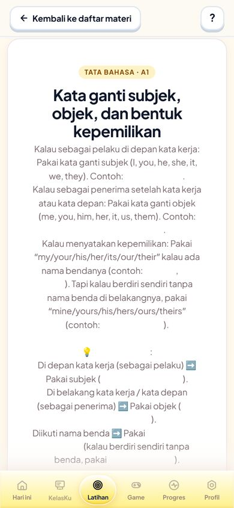

Semua `<b>` di `.grammar-brief-rule` — "She called me", "The teacher helped her", "her bag",
"This bag is hers", judul "RUMUS KILAT", dan daftar "I, He, She… / me, him, her…" — dirender
`rgb(255,255,255)` di atas kartu putih (kontras 1:1). Yang tersisa di layar hanya kalimat
penghubung dan lubang kosong. Tombol "Mulai 10 soal" juga terdorong ke bawah lipatan.

Penyebabnya dua lapis tema yang saling tindih:

- `features/ui/mobile-edge-fit.css:2125` →
  `.card h1, .card h2, .card h3, .card h4, .card b, .card strong { color:#FFFFFF !important }`
  (dibuat untuk kartu gelap `#151520`, m025-374);
- `features/ui/fiezel-tactile-clay.css` kemudian mengubah latar `.grammar-lesson-card`
  jadi putih tanpa mengembalikan warna `b/strong`.

Perbaikan langsung: `.grammar-brief-rule b, .grammar-brief-rule strong { color:#0F172A !important }`.
Perbaikan akar: aturan global `.card b {color:#fff !important}` hanya aman di kartu yang
benar-benar gelap. Batasi selektornya, atau buat gerbang kontras yang memotret kartu materi.
Gerbang `anti-flicker`/kontras yang ada tidak menangkap ini.

Versi Thai tidak terdampak karena aturan Thai-nya berupa satu paragraf tanpa `<b>`.

### G2. Murid Thai mencocokkan dengan arti Indonesia (Kritis)

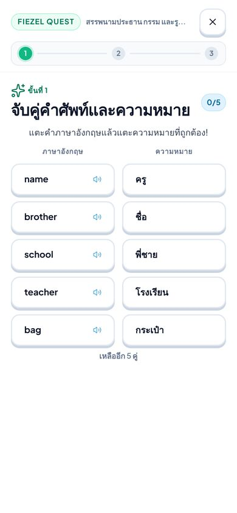

Label kolom sudah Thai (ความหมาย), tetapi isinya "guru, nama, tas, sekolah, saudara laki-laki".
Murid Thai tidak bisa menyelesaikan tahap ini kecuali menebak. Datanya ada:
`vocabulary-th.json` memetakan `teacher` → ครู, dan layar menang di quest yang sama
(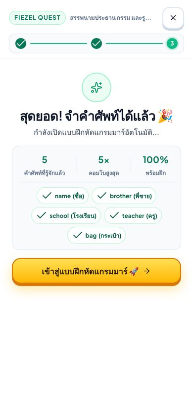) sudah menampilkan arti Thai.

Diukur di halaman: sesudah `FiezelThData.ready`, `V.find(word==='teacher').meaning` masih
`"guru"` saat `startVocabMiniGame()` berjalan, dan `idCards` disalin saat itu juga.
`getVocabForLesson()` membaca `V` sebelum overlay `vocabForLocale` diterapkan, lalu kartu
tahap 1 membeku dengan arti Indonesia. Tahap berikutnya dirender lebih lambat dan sempat
mendapat arti Thai. Perbaikan: pastikan overlay th sudah diterapkan ke `V` sebelum quest
dibuat (atau ambil arti langsung dari `FiezelThData.vocab.entries[id]` di bridge). Tambahkan
juga gerbang yang memulai quest dalam locale th dan menuntut arti ber-aksara Thai.

### G3. Apostrof mematikan keping kata (Tinggi)

`grammar-vocab-bridge.js:1049` merender
`onclick="FiezelGrammarVocabBridge.addPuzzleToken('${esc(tok)}')"`. `esc()` mengubah `'` jadi
`&#039;`, yang didekode kembali oleh parser atribut menjadi `'`. Hasilnya
`addPuzzleToken('can't')` → `SyntaxError: missing ) after argument list`.

Diverifikasi di browser: mengetuk keping `can't` tidak menambah apa pun dan melempar galat.
Ditemukan 10 kalimat puzzle yang terdampak, mis. A1 `some_any_countable_uncountable`
("I don't have any money") dan A2 `possessive_s_noun_ownership` ("It's Maya's"). Murid
macet di tahap 2 kecuali menutup quest. Pola yang sama ada di
`handleCardClick('${item.id}')` dan sebaiknya diganti dengan `data-*` + listener, atau
indeks angka alih-alih teks.

### G4. Kalimat puzzle templat (Tinggi)

`getAlignedSentenceForPuzzle()` hanya memakai bank grammar bila kata kosakata muncul di
kalimat soal yang ≤ 7 kata. Kalau tidak, ia memakai contoh kamus, lalu jatuh ke
`'We study ' + word + ' here.'`. Diukur atas 180 materi × 2 puzzle: **178 dari 360** kalimat
adalah templat itu ("We study present here", "We study chef here", "We study decision here").
Kalimat itu tidak memuat aturan grammar materinya, padahal tahap ini berjudul "Susun Kalimat
Tata Bahasa". Sebaiknya puzzle dilewati daripada memakai templat, atau dipilih kalimat dari
bank grammar materi itu sendiri walau tidak memuat kata kunci.

### G5. Petunjuk basi sesudah salah kedua (Sedang)

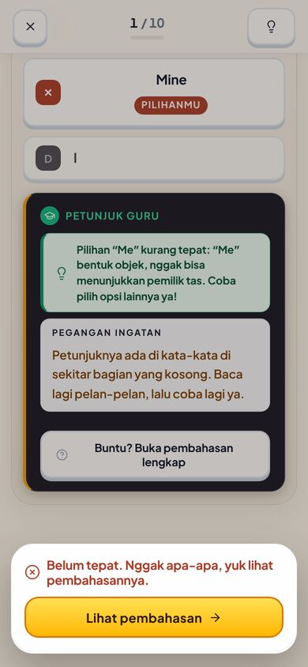

Murid memilih "Me" (salah) lalu "Mine" (salah). Panel PETUNJUK GURU masih berbunyi
*Pilihan "Me" kurang tepat…* sementara badge "PILIHANMU" menempel di "Mine". Panel itu perlu
diperbarui (atau disembunyikan) begitu pilihan kedua masuk.

### G6. Soal video tanpa video (Sedang)

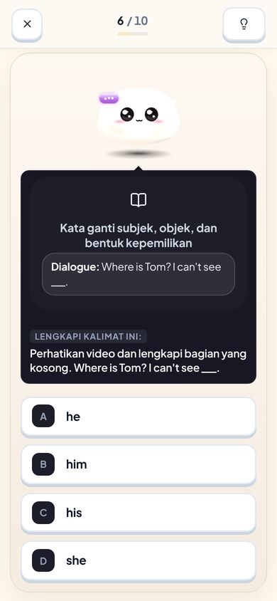

Instruksinya berbunyi "Perhatikan video dan lengkapi…", tetapi yang tampil hanya ikon buku,
judul materi, dan kotak "Dialogue". Kalimat "Where is Tom? I can't see ___." muncul dua kali
di kartu yang sama, dan sudah menjadi soal 4/10 (terjemahkan "Di mana Tom? Aku tidak bisa
melihatnya.") di sesi yang sama, jadi jawabannya sudah diberikan. Bila video tidak tersedia,
ubah instruksinya; dan jangan sajikan kalimat dasar yang sama dua kali dalam satu sesi.

### G7. Modal Prasasti menutupi skor (Sedang)

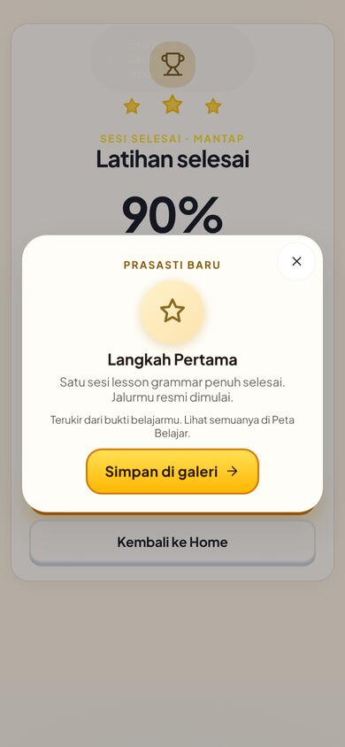

Begitu sesi selesai, "PRASASTI BARU · Langkah Pertama" langsung muncul di atas layar hasil
yang diredupkan. Murid tidak melihat 90%, rincian, atau "8 materi menunggu diulang" sebelum
menutupnya. Tampilkan prasasti sesudah layar hasil terbaca (tunda, atau sebagai kartu di
dalam layar hasil).

### G8. Pembahasan terlalu panjang (Sedang)

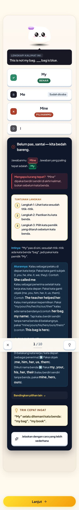

Satu soal salah → ±2.500 px konten. Isinya: "Mengapa kurang tepat", "Tuntunan langkah",
"Intinya", lalu **seluruh** aturan materi plus RUMUS KILAT (identik dengan kartu materi),
"Bandingkan pilihan lain", "Trik cepat ingat", dan "Jelaskan lebih sederhana". Murid SMP yang
salah cukup butuh 3 blok pertama. Aturan lengkap sebaiknya dilipat ("Lihat aturan lengkap").
Selain itu penjelasan *"Mine" dipakai berdiri sendiri di akhir kalimat* kurang tepat:
"Mine is blue." juga benar. Yang benar: "mine" tidak diikuti kata benda.

### G9. Tiga pesan untuk satu kesalahan (Sedang)

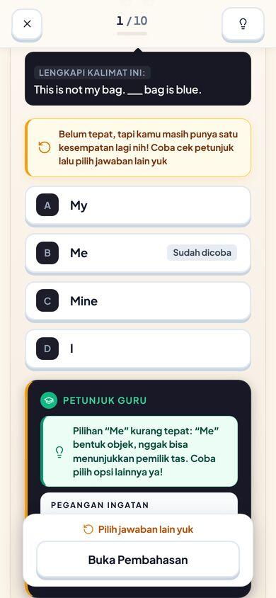

Sesudah salah pertama: kotak kuning "Belum tepat… Coba cek petunjuk lalu pilih jawaban lain
yuk", panel PETUNJUK GURU, lalu bilah bawah "Pilih jawaban lain yuk". Bilah bawah juga
menutupi panel "PEGANGAN INGATAN". Cukup satu pesan + petunjuk.

### G10–G16

- **G10** Soal 2/10 berlabel "PILIH KALIMAT YANG BENAR", padahal pilihannya I / mine / me / my.
  Seharusnya "LENGKAPI KALIMAT INI".
  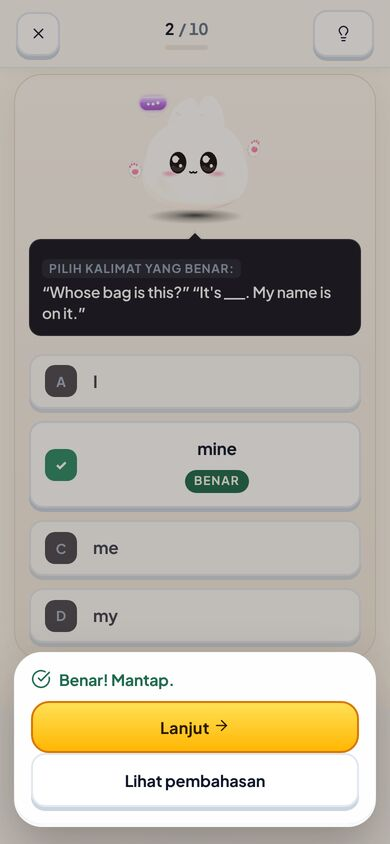
- **G11** Quest tahap 2 (th): "กฎไวยากรณ์: I, me, my: tiga wujud kata ganti". Judul aturan
  diambil dari `GRAMMAR_ITEMS.title` tanpa overlay Thai.
  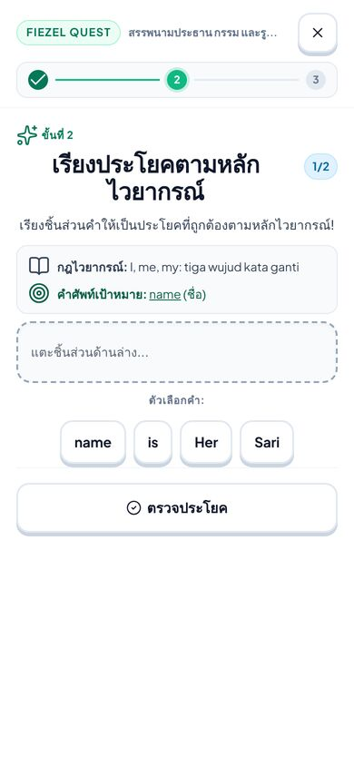
- **G12** Pilihan yang dijawab berubah jadi rata tengah + badge (BENAR / PILIHANMU), lebih
  tinggi dari kartu lain, sehingga isi di bawahnya melompat.
- **G13** Puzzle "Sari / is / Her / name". Kata yang berhuruf kapital pasti pembuka kalimat.
  Kecilkan semua keping (kecuali nama diri/"I") dan kapitalkan otomatis sesudah tersusun.
  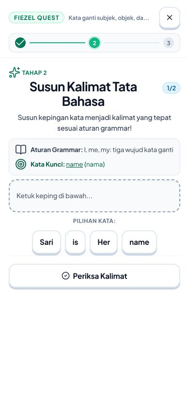
- **G14** Layar menang (id): "5 KOSAKATA DIKENALI", tetapi hanya 4 chip yang tampil ("bag"
  tidak terlihat); versi Thai menampilkan 5.
  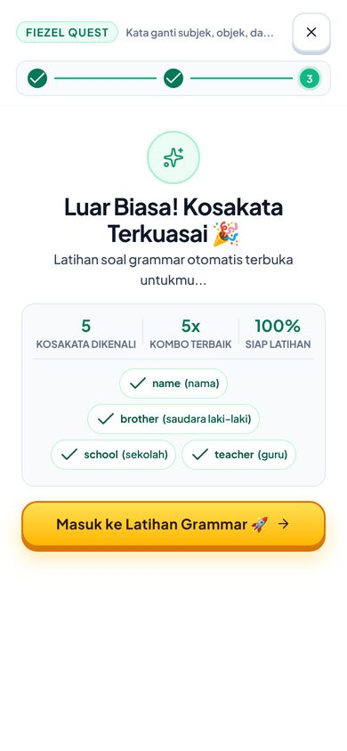
- **G15** "Luar Biasa! Kosakata Terkuasai · 100% siap latihan" sesudah sekali mencocokkan.
  "Terkuasai" berlebihan untuk satu paparan; "Kosakata siap dipakai" lebih jujur.
- **G16** Chip "Ujian Naik Level", "Sesi Kilat", "Video Grammar Lab", "Buka materi" di hub
  setinggi 32 px (pedoman 44 px). Tombol "Hapus" di soal susun kata kontras 2,9:1 (< 4,5:1).
  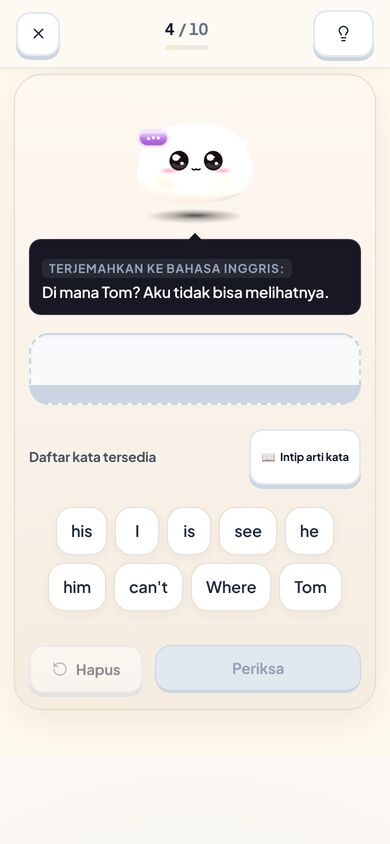

## Prioritas yang disarankan

1. G1 (satu baris CSS) dan G3 (escape onclick). Keduanya kecil, dan dampaknya ke murid
   langsung terasa.
2. G2 + G11. Murid Thai tidak bisa menyelesaikan quest tahap 1.
3. G4 dan G6. Konten quest/soal yang tidak mengajarkan materinya.
4. G5, G7, G8, G9. Kebisingan umpan balik.
